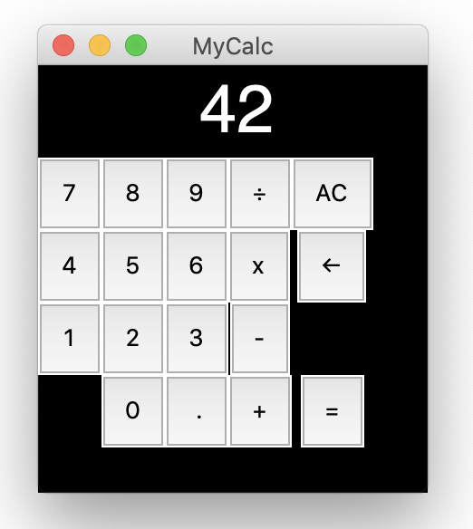

# guizero-calc

A very basic Python calculator with a GUI made with guizero, a library for making it easier for beginners to start creating GUIs in Python.

See http://www.suppertime.co.uk/blogmywiki/2020/11/python-calculator-guizero/ for more details.
